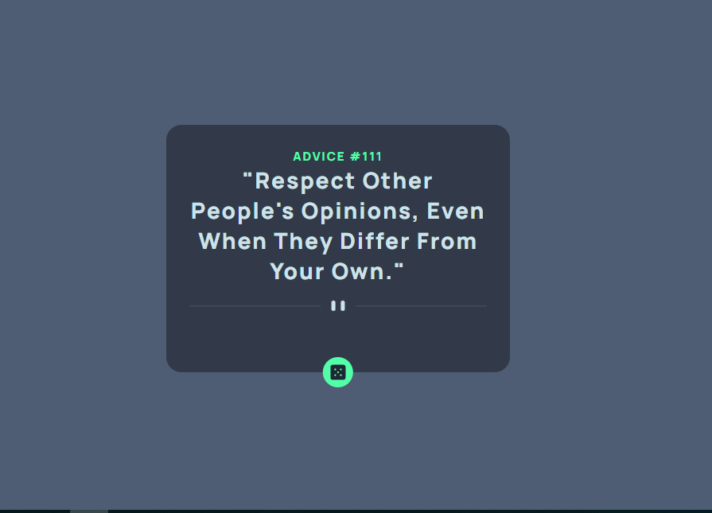

# Frontend Mentor - Advice generator app solution

This is a solution to the [Advice generator app challenge on Frontend Mentor](https://www.frontendmentor.io/challenges/advice-generator-app-QdUG-13db). Frontend Mentor challenges help you improve your coding skills by building realistic projects.

## Table of contents

- [Overview](#overview)
  - [The challenge](#the-challenge)
  - [Screenshot](#screenshot)
  - [Links](#links)
- [My process](#my-process)
  - [Built with](#built-with)
  - [What I learned](#what-i-learned)
  - [Continued development](#continued-development)
  - [Useful resources](#useful-resources)
- [Author](#author)
- [Acknowledgments](#acknowledgments)

## Overview

### The challenge

Users should be able to:

- View the optimal layout for the app depending on their device's screen size
- See hover states for all interactive elements on the page
- Generate a new piece of advice by clicking the dice icon

### Screenshot

### Links

- Solution URL: [https://github.com/Dammie0/Advice-Generator-App.git](https://your-solution-url.com)
- Live Site URL: [https://advice-generator-app-22.netlify.app/](https://your-live-site-url.com)

## My process

### Built with

- Semantic HTML5 markup
- CSS custom properties
- Flexbox
- CSS Grid
- Mobile-first workflow
- [React](https://reactjs.org/) - JS library
- [Next.js](https://nextjs.org/) - React framework
- [Styled Components](https://styled-components.com/) - For styles

**Note: These are just examples. Delete this note and replace the list above with your own choices**

### What I learned
I learnt how to use the hover element in css and the box shadow. Here's a snippet on what i learnt

.advice-btn:hover{
    box-shadow: rgba(82,255,169,0.466) 0px 8px 24px, 
                rgba(82,255,169,0.411) 0px 16px 56px, 
                rgba(82,255,169,0.479) 0px 24px 80px ;
}

### Continued development
Continuous practice and building of projects.

## Author

- Website - [Add your name here](https://www.your-site.com)
- Frontend Mentor - [@Dammie0](https://www.frontendmentor.io/profile/yourusername)
- Twitter - [@d_ebus](https://www.twitter.com/yourusername)

## Acknowledgments
Gratitude to my web3bridge Mentor, Miss Adetutu for giving us this project to work on API's. Although i had some blockers, i know i will resolve them.
